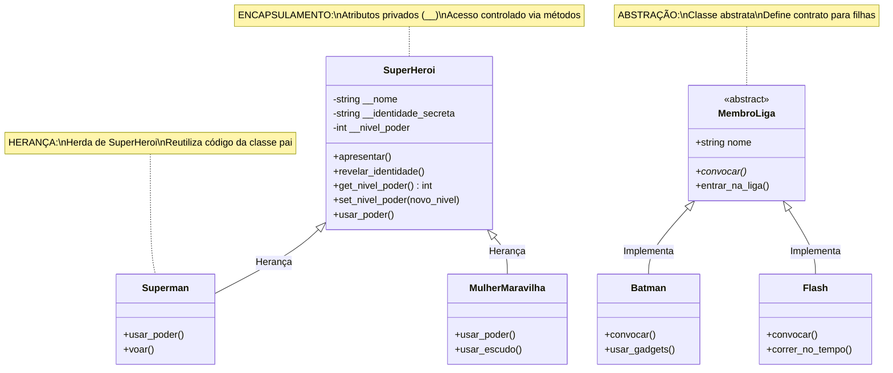
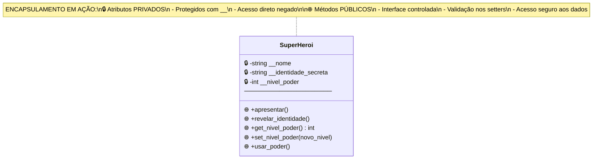
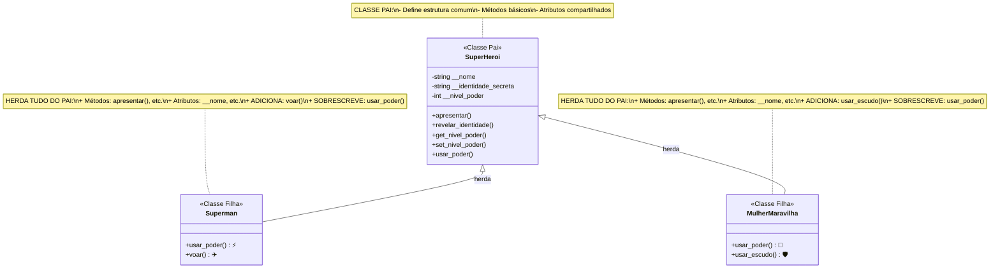
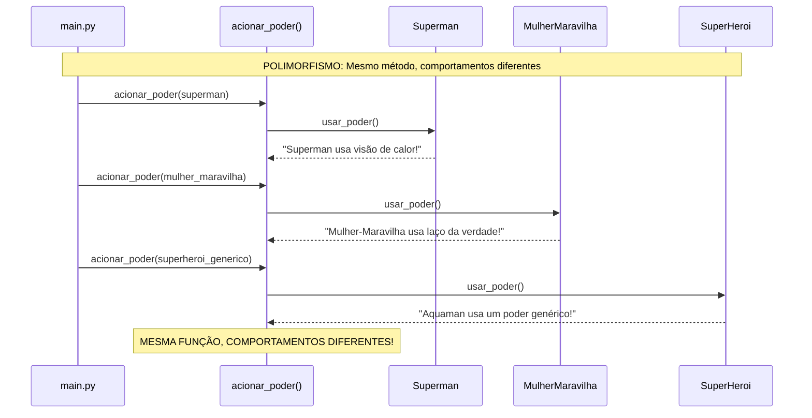
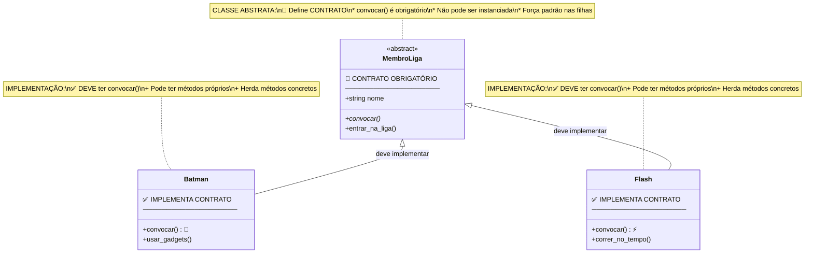

# Tutorial: Introdução à Programação Orientada a Objetos com Python

**Por:** Issao Hanaoka Junior - UNIP (Universidade Paulista)  
**Curso:** Tecnologia em Análise e Desenvolvimento de Sistemas  
**Duração estimada:** 15 minutos  
**Tema:** Liga da Justiça 🦸‍♂️🦸‍♀️

## O que você vai aprender?

- ✅ Entender o que é Programação Orientada a Objetos (POO)
- ✅ Aprender os 4 pilares da POO: Encapsulamento, Herança, Polimorfismo e Abstração
- ✅ Ver exemplos práticos em Python (estrelando a Liga da Justiça)
- ✅ Descobrir como a POO ajuda a organizar e reutilizar código em projetos reais
- ✅ Desenvolver uma visão mais estruturada de como programadores modelam o mundo real

## Estrutura do Projeto

```
poo_py/
├── main.py                 # Arquivo principal com as demonstrações
├── superheroi.py          # Classe base - demonstra ENCAPSULAMENTO
├── superman.py            # Classe filha - demonstra HERANÇA
├── mulhermaravilha.py     # Classe filha - demonstra HERANÇA  
├── polimorfismo.py        # Funções que demonstram POLIMORFISMO
├── ligadajustica.py       # Classe abstrata - demonstra ABSTRAÇÃO
├── batman.py              # Implementa classe abstrata
├── flash.py               # Implementa classe abstrata
├── README.md              # Este arquivo (documentação completa)
└── diagramas.md           # Diagramas UML detalhados
```

## Os 4 Pilares da POO

### 1. 🔒 Encapsulamento
- **O que é:** Protege os dados dos objetos
- **Como:** Atributos privados (`__nome`) + métodos públicos (getters/setters)
- **Vantagem:** Controle de acesso e validação de dados
- **Arquivo:** `superheroi.py`

### 2. 👨‍👩‍👧‍👦 Herança
- **O que é:** Uma classe filha herda características da classe pai
- **Como:** `class Superman(SuperHeroi)` + `super().__init__()`
- **Vantagem:** Reutilização de código
- **Arquivos:** `superman.py`, `mulhermaravilha.py`

### 3. 🎭 Polimorfismo
- **O que é:** Mesmo método, comportamentos diferentes
- **Como:** Sobrescrever métodos (`usar_poder()`)
- **Vantagem:** Flexibilidade e extensibilidade
- **Arquivo:** `polimorfismo.py`

### 4. 🎯 Abstração
- **O que é:** Define um "contrato" que classes filhas devem seguir
- **Como:** Classes abstratas com `@abstractmethod`
- **Vantagem:** Padronização e organização
- **Arquivos:** `ligadajustica.py`, `batman.py`, `flash.py`

## Como executar

```bash
python main.py
```

## 📋 Como Visualizar os Diagramas

Os diagramas foram criados usando **Mermaid**, uma linguagem de diagramação que é suportada nativamente pelo GitHub, GitLab e muitas outras plataformas.

### Benefícios dos Diagramas:

- 🧠 **Aprendizado Visual:** Facilita a compreensão dos conceitos abstratos
- 🔗 **Conexão Conceito-Código:** Liga teoria à implementação prática
- 📚 **Material de Referência:** Pode ser consultado para estudos
- 🎯 **Foco Didático:** Cada diagrama destaca um pilar específico da POO

**💡 Dica:** Os diagramas são renderizados automaticamente aqui no GitHub. Para uma visão mais detalhada, consulte o arquivo `diagramas.md`.

## Conceitos Python Utilizados

- ✅ Classes e objetos
- ✅ Atributos privados (`__atributo`)
- ✅ Herança com `super()`
- ✅ Classes abstratas (`abc.ABC`)
- ✅ Métodos abstratos (`@abstractmethod`)
- ✅ Sobrescrita de métodos
- ✅ Getters e Setters
- ✅ Docstrings para documentação

## Recursos Adicionais

- [Documentação oficial Python - Classes](https://docs.python.org/3/tutorial/classes.html)
- [PEP 8 - Guia de Estilo Python](https://pep8.org/)
- [abc - Abstract Base Classes](https://docs.python.org/3/library/abc.html)

---

**💡 Atividade de Extensão - UNIP**  
*Este projeto faz parte das atividades de extensão do curso de Tecnologia em Análise e Desenvolvimento de Sistemas da Universidade Paulista.*

## Diagramas UML - Visualização dos Conceitos

### 📊 Diagrama Geral - Relacionamentos entre Classes



### 1. 🔒 Diagrama do Encapsulamento



**Conceitos Demonstrados:**
- 🔒 **Atributos Privados:** `__nome`, `__identidade_secreta`, `__nivel_poder`
- 🌐 **Interface Pública:** Métodos que controlam o acesso
- ✅ **Validação:** Setter valida se nível está entre 0-100
- 🛡️ **Proteção:** Dados não podem ser alterados diretamente

### 2. 👨‍👩‍👧‍👦 Diagrama da Herança



**Conceitos Demonstrados:**
- 🧬 **Reutilização:** Classes filhas herdam tudo da classe pai
- 🔄 **super():** Chama o construtor da classe pai
- ➕ **Extensão:** Classes filhas podem adicionar novos métodos
- 🔄 **Sobrescrita:** Classes filhas podem redefinir métodos existentes

### 3. 🎭 Diagrama do Polimorfismo



**Conceitos Demonstrados:**
- 🎯 **Interface Comum:** Todos têm método `usar_poder()`
- 🎭 **Comportamentos Diferentes:** Cada classe implementa à sua maneira
- 🔄 **Flexibilidade:** Código funciona com qualquer tipo de herói
- 📈 **Extensibilidade:** Novos heróis podem ser adicionados facilmente

### 4. 🎯 Diagrama da Abstração



**Conceitos Demonstrados:**
- 🎯 **Contrato:** Classes filhas DEVEM implementar métodos abstratos
- 🚫 **Não Instanciável:** Classe abstrata não pode criar objetos
- 📐 **Padronização:** Força estrutura comum entre classes filhas
- 🔧 **Flexibilidade:** Cada filha implementa do seu jeito
