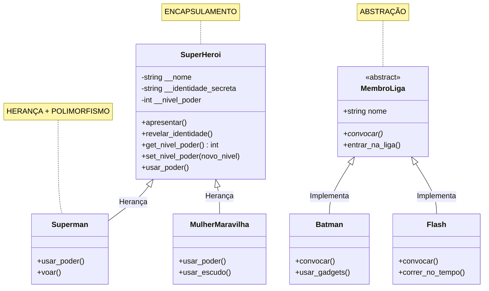
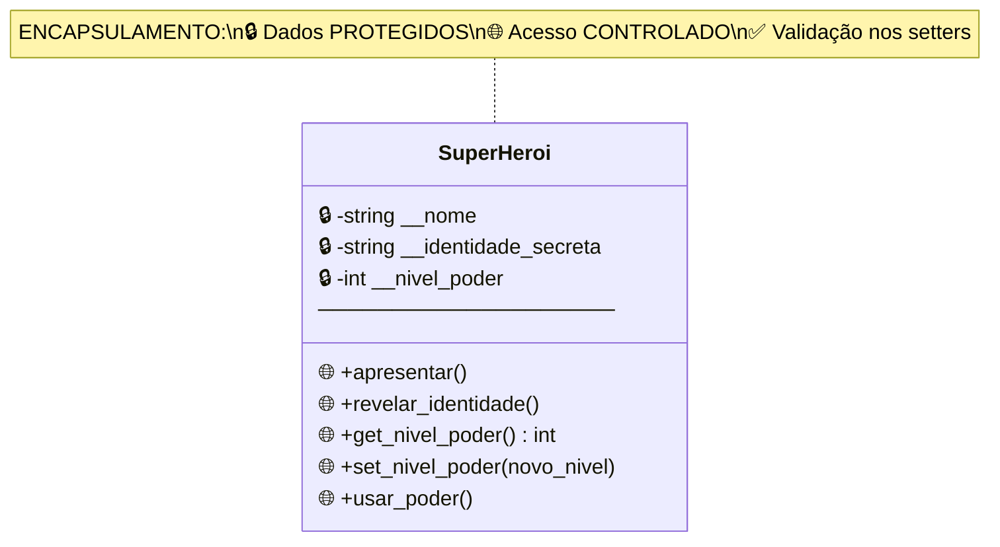
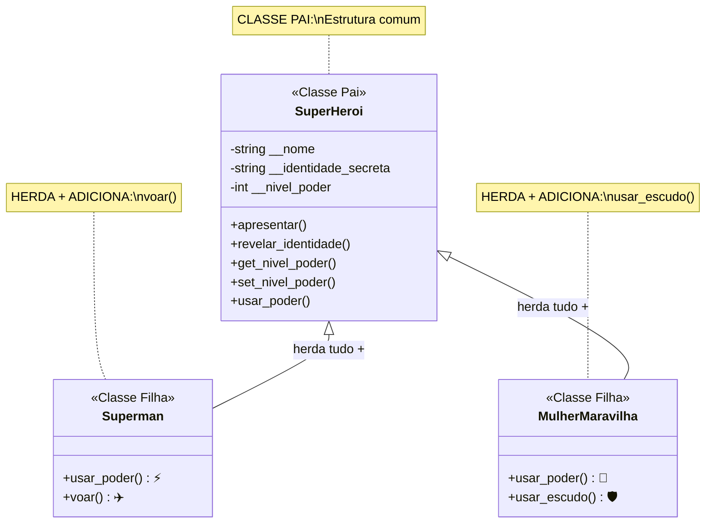
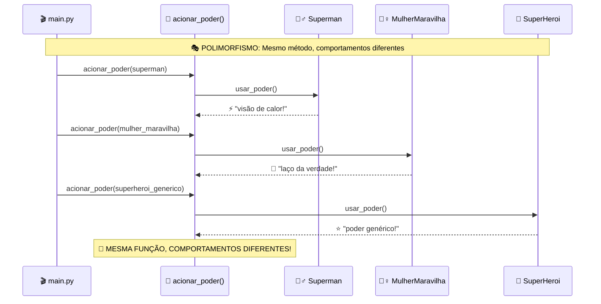
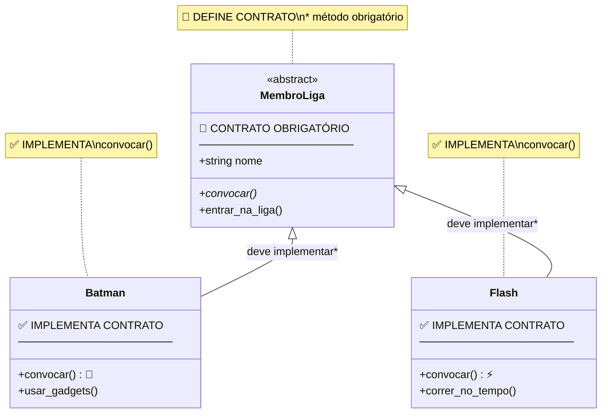
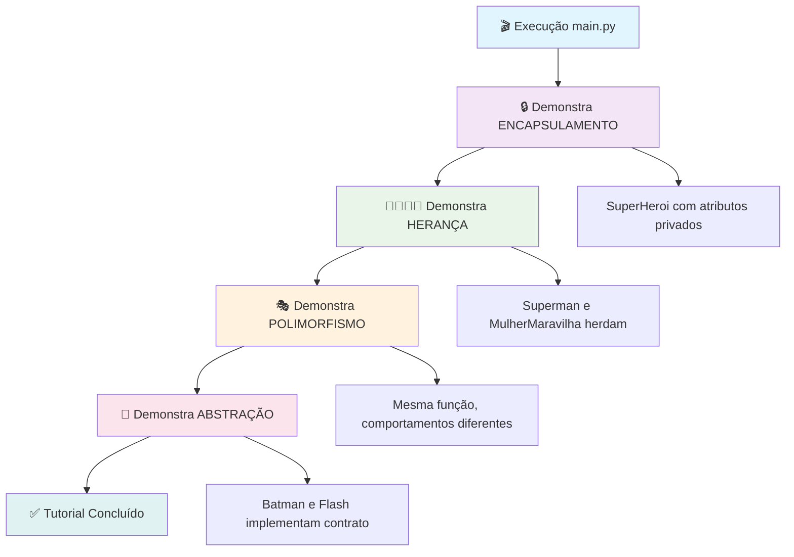

# Diagramas UML - POO com Python (Liga da Justiça)

## 📊 Diagrama Geral - Relacionamentos

## 🔒 1. Encapsulamento

## 👨‍👩‍👧‍👦 2. Herança

## 🎭 3. Polimorfismo

## 🎯 4. Abstração

## 🔄 Fluxo de Execução

---

**💡 Como usar durante a gravação:**

1. **Prepare os diagramas com antecedência** - teste a visualização
2. **Mostre o diagrama ANTES de codificar** - contexto visual primeiro
3. **Conecte código com diagrama** - aponte elementos enquanto explica
4. **Use como referência** - volte ao diagrama para recapitular
5. **Destaque as diferenças** - compare os diagramas entre si
